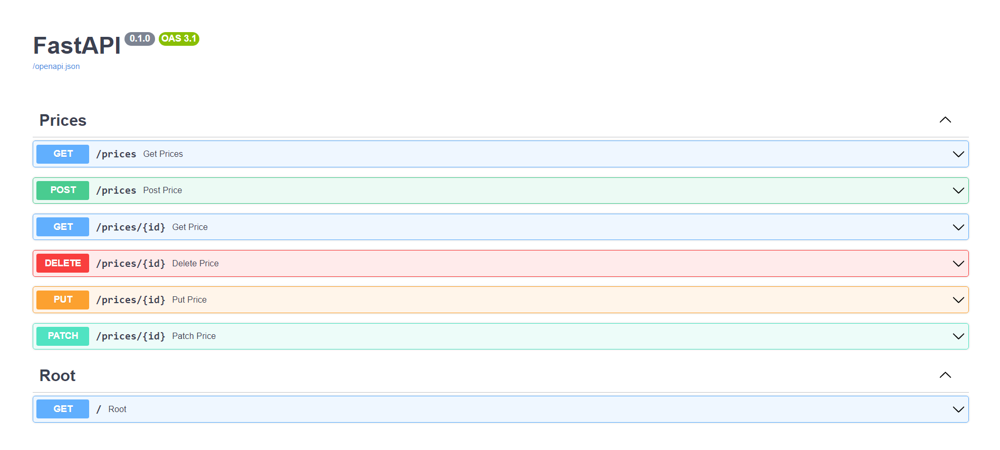

# Веб-протоколы и REST API. Летняя практика 2023 в УрФУ

## Финальная версия проекта
Развернута на хостинге [repl.it](https://repl.it). Документация к проекту находится [здесь](https://summerpractice.codenjoyer.repl.co/docs).

## Используемые технологии
- Python 3.11
- FastAPI
- SQLAlchemy
- Pydantic
- SQLite
- requests
- Selenium
- BeautifulSoup
- logging
- [timeloop-ng](https://github.com/tuergeist/timeloop)

## Задание 1. Написание парсеров страниц при помощи requests и Selenium

Код находится в папке `parsing`, парсится конкретный товар на сайте [ozon](https://www.ozon.ru/product/harakteristiki-konstruktor-lego-super-heroes-novyy-asgard-bro-tora-76200-859801694/?asb2=B8PRssGyAeoWU8jpF_ZTebYXhw3hqIxWADUfVDZXbaZGofw7zcLjGPLhZTrWBHQn&avtc=1&avte=2&avts=1688657443&keywords=%D0%9A%D0%BE%D0%BD%D1%81%D1%82%D1%80%D1%83%D0%BA%D1%82%D0%BE%D1%80+LEGO&sh=G9o2ckYwYg).
Получаем HTML-разметку страницы и при помощи *BeautifulSoap* находим интересующие нас элементы: имя товара и цену.

## Задание 2. Работа с базой данных и ORM - SQLAlchemy.

Код находится в папке `db`, на этот раз парсится страница с товарами на
сайте [onlinetrade](https://onlinetrade.ru/catalogue/noutbuki-c9).
Создается подключение к базе данных **SQLite**, в которую записываются данные о товарах.
Присутствует логирование при помощи модуля *logging*.

## Задание 3. Работа с REST API

Создан проект на Fast API в папке `src`. В нём реализованы все базовые методы HTTP-запросов (**GET, POST, DELETE, PUT,
PATCH**).
В качестве базы данных используется **SQLite**. Для работы с ней используется **SQLAlchemy** и схемы **Pydantic**. Написан парсер
для сайта [faberlic](https://faberlic.com/index.php), который парсит страницу с товарами и записывает их в базу данных.
Для парсинга используются *requests* и *BeautifulSoup*. Для логирования используется модуль *logging*. Так же есть sender,
который отправляет полученные данные на запущенный сервер с использованием метода **POST**.
